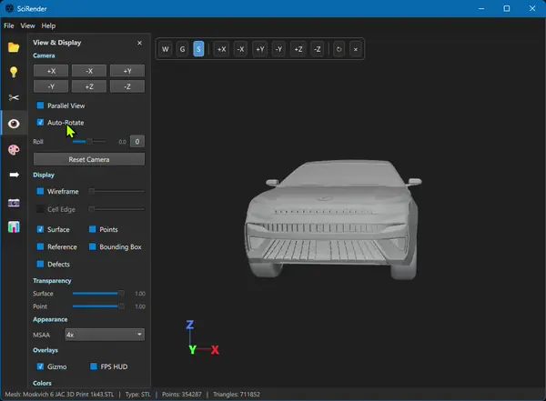

<h1 align="center">SciRender</h1>


<p align="center">

  
  
  
  

  <br/>

  

</p>

<p align="center">
  
  &nbsp;&nbsp;&nbsp;&nbsp;&nbsp;&nbsp;&nbsp;&nbsp;&nbsp;&nbsp;&nbsp;&nbsp;&nbsp;&nbsp;&nbsp;&nbsp;&nbsp;&nbsp;&nbsp;&nbsp;
  
</p>

Qt 6 + OpenGL scientific mesh rendering toolkit. Loads VTK
`STRUCTURED_GRID` (curvilinear), `RECTILINEAR_GRID`, `STRUCTURED_POINTS`,
`POLYDATA`, `UNSTRUCTURED_GRID` and STL files, maps scalar point
data to surface colormaps, and draws instanced vector-field arrow glyphs.
A camera-relative Light Kit, axis triad, clipping/slicing planes, LOD
and screenshot export round out the feature set, all driven from a QML
control panel.

## Build

Requires **Qt 6** (Core, Gui, Qml, Quick, QuickControls2, OpenGLWidgets),
**OpenGL**, a C++20 compiler, CMake ≥ 3.16, and GLAD/GLM (vendored under
`vendor/`, no install needed).

```bash
cmake -S . -B build -DCMAKE_PREFIX_PATH="<path-to-Qt6>"
cmake --build build -j4
```

The shaders in `src/shaders/` are copied next to the binary at build time, so
the program can run from the build directory.

## Features

- Loads VTK `STRUCTURED_GRID` (curvilinear), `RECTILINEAR_GRID`,
  `STRUCTURED_POINTS`, `POLYDATA`, `UNSTRUCTURED_GRID` and STL
- Scalar surface coloring with colormaps; per-dataset **surface** tessellation
  for curvilinear grids (boundary shell, not the full volume)
- Vector field arrow glyphs (instanced, uniform-length)
- **Colorbar legend:** clean gradient bar with a user-controllable number of
  tick labels (`colorbarTicks`, 2–20) spread across the live data range;
  applies to both the scalar and vector-magnitude bars
- Clipping/slicing planes; clipping auto-resets to disabled on each new mesh load
- Camera-relative Light Kit: key/fill/back/head lights that track the view,
  key intensity + K-ratios, kit-wide warm tint
- Axis triad + light-direction markers in a corner overlay
- Screenshot export (PNG/JPEG/BMP), optional transparency
- QML side panel: lighting, slicing/clipping, colormap, presets, recent files
- **Robust mesh loading:** exact STL vertex dedup, and level-of-detail (LOD)
  that is safe for multi-shell surfaces while orbiting

### Level of Detail (LOD)

LOD shows a coarser mesh only while the camera is moving, then snaps back to
full detail when motion stops. It is used only when all of the following hold:

- **Dataset type:** volumetric grids (`STRUCTURED_GRID`, `RECTILINEAR_GRID`,
  `STRUCTURED_POINTS`) and surface meshes (`STL`, `POLYDATA`,
  `UNSTRUCTURED_GRID`).
- **Size:** at least 4000 vertices.
- **Worthwhile:** the decimated mesh has less than half the original triangles.
- **Multi-shell safe:** a single connected solid is always supported. Meshes
  with multiple disconnected parts are only decimated when the parts are far
  enough apart that they cannot be merged; otherwise full resolution is used.

## Layout

| Path | Purpose |
|------|---------|
| `src/app/` | Qt/QML application entry point (`main.cpp`) |
| `src/core/` | VTK/STL parsers, mesh loading, mesh-quality analysis, camera, colormap definitions |
| `src/render/` | OpenGL renderer, lighting, mesh/LOD upload, vector glyphs, colorbar, axis triad |
| `src/shaders/` | GLSL vertex/fragment shaders |
| `src/ui/` | Custom QML viewport item |
| `tests/` | Standalone parser regression harness (`parse_regression.cpp` + `run_tests.{bat,sh}`) |
| `samples/` | VTK/STL fixture files used by the regression harness |
| `assets/` | Application icon |
| `vendor/` | GLAD, GLM |

## License

No license
