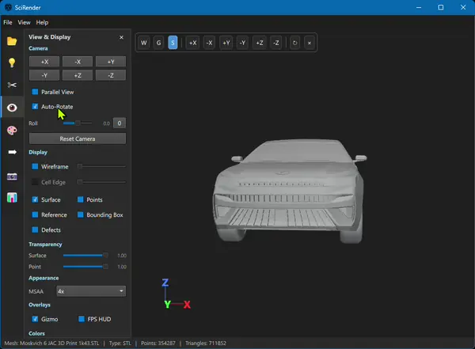

<h1 align="center">SciRender</h1>


<p align="center">

  
  
  
  

  <br/>

  

</p>

<p align="center">
  
  &nbsp;&nbsp;&nbsp;&nbsp;&nbsp;&nbsp;&nbsp;&nbsp;&nbsp;&nbsp;&nbsp;&nbsp;&nbsp;&nbsp;&nbsp;&nbsp;&nbsp;&nbsp;&nbsp;&nbsp;
  
</p>

Qt 6 + OpenGL scientific rendering application. Loads VTK
`STRUCTURED_GRID` (curvilinear), `RECTILINEAR_GRID`, `STRUCTURED_POINTS`,
`POLYDATA`, `UNSTRUCTURED_GRID`, STL & OBJ files, maps scalar
data to surface colormaps, draws instanced vector-field arrow glyphs,
integrated streamlines, particle traces, and volume ray-marching.
A PBR lighting system, axis triad, clipping/slicing planes, level-of-detail (LOD),
depth-peel transparency, screenshot export, and a rich Qt Widgets sidebar.

## Build

Requires **Qt 6** (Core, Gui, Widgets, OpenGLWidgets), **OpenGL**,
a C++20 compiler, CMake ≥ 3.16, and GLAD/GLM (vendored under
`vendor/`, no install needed).

```bash
cmake -S . -B build -DCMAKE_PREFIX_PATH="<path-to-Qt6>"
cmake --build build -j4
```

The shaders in `src/shaders/` are copied next to the binary at build time, so
the program can run from the build directory.

## Features

- Loads VTK `STRUCTURED_GRID` (curvilinear), `RECTILINEAR_GRID`,
  `STRUCTURED_POINTS`, `POLYDATA`, `UNSTRUCTURED_GRID`, STL and OBJ
- Scalar surface coloring with colormaps; per-dataset **surface** tessellation
  for curvilinear grids (boundary shell, not the full volume)
- Vector field arrow glyphs with user-controllable density and scaling
- **Streamline integration** with configurable step size, max steps, direction,
  seeding modes (volume/surface/plane), jitter, and particle appearance
- **Particle traces** with count, speed, and size controls
- **Volume ray-marching** with step size, opacity, and colormap controls
- **Colorbar legend:** clean gradient bar with a user-controllable number of
  tick labels (`colorbarTicks`, 2–20) spread across the live data range;
  applies to scalar, vector-magnitude, and volume colorbars
- **Lighting system:** key/fill/back/head lights that track the view,
  key intensity + K-ratios, kit-wide warm tint, material roughness/metallic/specular
- **Slicing & clipping:** axis-aligned clip planes with bounds-aware sliders
- Axis triad + light-direction markers in a corner overlay
- FPS Head up Display (HUD)
- **Quality overlays:** degenerate triangle, open-edge, and non-manifold edge visualization
- **Screenshot export** (PNG/JPEG/BMP), optional transparency, resolution and AA presets
- **Depth-peel transparency** for correct rendering of translucent surfaces
- **Robust mesh loading:** exact vertex dedup, and level-of-detail (LOD)
  that is safe for multi-shell surfaces while orbiting

### Level of Detail (LOD)

LOD shows a coarser mesh only while the camera is moving, then snaps back to
full detail when motion stops. It is used only when all of the following hold:

- **Dataset type:** volumetric grids (`STRUCTURED_GRID`, `RECTILINEAR_GRID`,
  `STRUCTURED_POINTS`) and surface meshes (`STL`, `POLYDATA`,
  `UNSTRUCTURED_GRID`).
- **Size:** at least 4000 vertices.
- **Worthwhile:** the decimated mesh has less than half the original triangles.
- **Multi-shell safe:** a single connected solid is always supported. Meshes
  with multiple disconnected parts are only decimated when the parts are far
  enough apart that they cannot be merged; otherwise full resolution is used.

## Layout

| Path | Purpose |
|------|---------|
| `src/app/` | Application entry point (`main.cpp`, GPU preference) |
| `src/core/` | VTK/STL parsers, mesh loading, mesh-quality analysis, camera, colormap definitions |
| `src/render/` | OpenGL renderer, lighting, mesh/LOD upload, vector glyphs, streamlines, particles, volume pass, colorbar, axis triad, screenshot capture |
| `src/shaders/` | GLSL vertex/fragment/compute shaders |
| `src/ui/` | Qt Widgets main window, sidebar pages, viewport widget |
| `tests/` | Standalone parser regression harness (`parse_regression.cpp` + `run_tests.{bat,sh}`) |
| `samples/` | VTK/STL fixture files used by the regression harness |
| `assets/` | Application icon |
| `vendor/` | GLAD, GLM |

## License

MIT license
